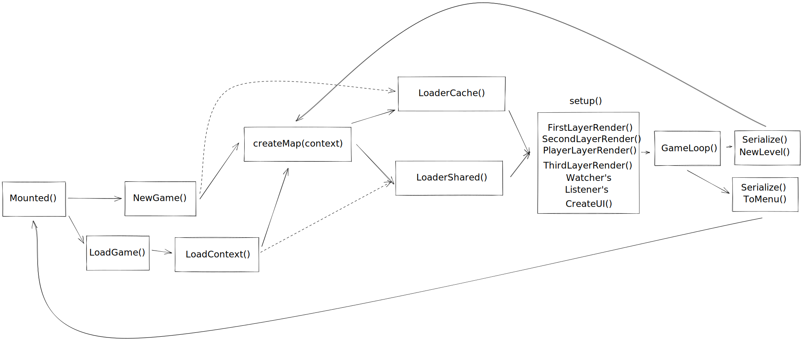

# RPG In Web

Example implementation RPG on the web

[DEMO](https://konstanta.novout.vercel.app)
[API Docs](https://novout.github.io/konstanta)

## Motivation

The main motivation was trying to see how far we can build scalable games (different from enterprise systems) on the web in the same way as desktop games.

## Tecnologies

- [Git](https://git-scm.com/)
- [Yarn](https://yarnpkg.com/)
- [Snowpack](https://www.snowpack.dev/)
- [PixiJS](https://www.pixijs.com/)
- [ThreeJS](https://threejs.org/)
- [GSAP](https://greensock.com/)
- [Obsidian](https://obsidian.md/)

### Structure

```
    .
    ├── core
    |   └── debugger                     # Dev Mode
    |   └── defines                      # .json and .toml static
    |   └── emitter                      # Objects, animations etc... in scene
    |   └── event                        # Triggers in event loop
    |   └── generate                     # Create contents
    |   └── gsap                         # Animations
    |   └── interceptor                  # Actions
    |   └── map                          # Opinions of countries according to the story / ideology
    |   └── pixi                         # Scripts
    |   └── render                       # Create and insert generate content
    |   └── rig                          # Create interactive sprite's
    |   └── serialize                    # Load/save resources
    |   └── ui                           # Create/Render interface
    |   └── utils                        # General stuff
    |   └── watcher                      # Control external events
    ├── game
    |   └── manager                      # Context interceptors
    |   └── newgame                      # Context creators
    ├── pages
    |   └── components                   # Components for construction interface without webgl context
    |   └── css                          # .css defines in context render
    |   └── loader.js                    # Process load game bar
    |   └── menu.js                      # ThreeJs Menu
    ├── index.js                         # Entrypoint
    ├── index.json                       # package.json copy for build access
```

### Cycle


